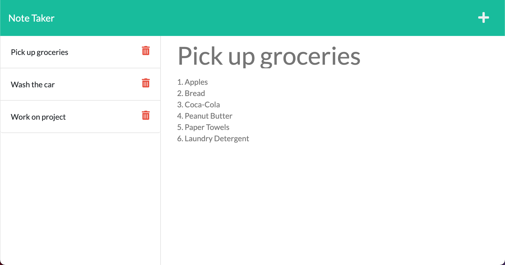

# Unit 11: Express.js Note Taker Application
## Description

The objective of this unit was to create a server-side API using the Express.js framework that uses routing to handle server-side responses to client-side URL requests. The application highlights use of three of the most commonly used HTTP methods, including POST, GET, and DELETE to create a working front-end and back-end application.

In terms of app functionality, it is built to allow users to input and save simple notes or to-do list items, including a title and text for each, and then delete them as necessary.

## Table of Contents

- [Screenshot](#screenshot)
- [Deployed Application](#deployed-application)
- [Credits](#credits)
- [License](#license)

## Screenshot
This is a screenshot of the front-end application.

## Deployed Application
Link: https://salty-savannah-39172.herokuapp.com/

## Credits
- Trilogy Education Services, LLC: https://www.trilogyed.com/
- Heroku: https://heroku.com
- NodeJS: https://nodejs.org/en/
- Express.js: https://expressjs.com/
- Bootstrap: https://getbootstrap.com/
- Font Awesome: https://fontawesome.com/

## License

This project was created by James L. Jenks as part of the curriculum for the MSU Coding Boot Camp and Trilogy Education Services.

© 2021 Trilogy Education Services, LLC, a 2U, Inc. brand. Confidential and Proprietary. All Rights Reserved.
    